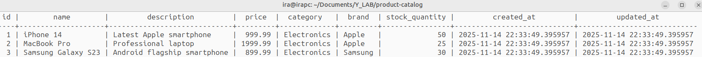

# Product Catalog Service JDBC Migration Postgres

**II Задание в рамках Java интенсива от Y_LAB** 

[ТЗ подробнее](./task.md)

## Технологический стек

- Java 17
- Maven 3.6+
- Java Core Collections
- Postgres 15 (миграция с файловой системы)
- Liquibase (управление миграциями БД)
- Docker & Docker Compose (контейнеризация БД)
- HikariCP (пул соединений)
- Testcontainers (интеграционное тестирование)

## Архитектурные изменения

### Миграция на реляционную БД

- Репозитории переписаны с файловой системы на PostgreSQL
- JDBC-реализации для ProductRepository и UserRepository
- **Sequence**-идентификаторы, автоматическая генерация ID

### Управление схемами БД

- Схема marketplace - таблицы сущностей (products, users)
- Схема audit - служебные таблицы Liquibase + логи аудита
- Изолированные пространства - соблюдение требований по разделению схем

### Миграции Liquibase

**Структура changelog**


## Функциональные возможности

### Миграция данных

- Автоматическое создание таблиц при первом запуске
- Версионность - контроль изменений схемы БД
- Предзаполнение тестовыми пользователями и товарами





### Система авторизации и ролей

**USER (Обычный пользователь)**
- Просмотр всех товаров
- Поиск товара по ID
- Поиск товара по имени
- Поиск товаров по категории
- Поиск товаров по бренду
- Просмотр статистики кэша
- Просмотр времени выполнения операций

**MANAGER (Менеджер)**
- Все возможности USER
- Добавление новых товаров
- Обновление существующих товаров
- Удаление товаров
- Просмотр журнала аудита

**ADMIN (Администратор)**
- Все возможности MANAGER
- Управление пользователями

### Управление товарами

- **Добавление товаров** - название, описание, цена, категория, бренд, количество
- **Просмотр товаров** - краткий и подробный формат отображения
- **Поиск и фильтрация** - по ID, названию, категории, бренду
- **Обновление товаров** - изменение всех параметров существующих товаров
- **Удаление товаров** - удаление по идентификатору

### Управление пользователями

- **Добавление пользователей** 
- **Просмотр пользователей** 
- **Поиск пользователей** 
- **Обновление пользователей** 
- **Удаление пользователей** 

### Производительность и мониторинг

- **Кэширование данных** - трехуровневый кэш (по ID, категориям, брендам)
- **Статистика кэша** - эффективность попаданий, размеры кэшей
- **Метрики приложения** - статистика операций, экстремумы
- **Журнал аудита** -  логирование всех действий пользователей

## Конфигурация

### Файлы конфигурации

- properties
- Docker Compose

## Быстрый старт

### Сборка и запуск

```bash
# Клонирование репозитория
git clone <repository-url>
cd product-catalog

# Сборка проекта
mvn clean compile

# Запуск приложения
mvn exec:java -Dexec.mainClass="org.idvairaz.App"
```
### Запуск через IDE

- Откройте проект в IntelliJ IDEA или другой Java IDE
- Найдите класс org.idvairaz.App
- Запустите метод main()

### Запуск с Docker 

```bash
# Запуск PostgreSQL в контейнере
docker compose up -d

# Подключение к БД:
psql -h localhost -p 5432 -U marketplace_user -d marketplace_db

пароль marketplace_pass

# Показать все схемы в базе данных:
\dn

# Показать все таблицы в текущей схеме:
\dt

# Показать все таблицы во всех схемах:
\dt *.*

# Показать таблицы в конкретной схеме (marketplace):
\dt marketplace.*

# Показать информацию о таблице
\d table_name

# Показать все последовательности
\ds
```

### Мониторинг журнала аудита

Все действия пользователей логируются в таблице audit.logs.


```bash
# Просмотр записей аудита
SELECT * FROM audit.logs;

# Статистика действий по пользователям
SELECT username, action, COUNT(*) as count 
FROM audit.logs 
GROUP BY username, action 
ORDER BY count DESC;
```

## Тестирование 

### Стратегия тестирования

- Интеграционные тесты с Testcontainers:
  - Полноценное тестирование репозиториев с реальной PostgreSQL в Docker-контейнерах
  - Автоматическое создание и очистка тестовой БД для каждого тестового класса
  - Проверка корректности SQL-запросов и работы с sequence

### Отчеты о покрытии
Отчет JaCoCo генерируется по пути target/site/jacoco/index.html и показывает детальную статистику покрытия кода тестами.

## Особенности реализации

### Миграционные скрипты Liquibase
### Управление соединениями
- Hikari Connection Pool - эффективное управление соединениями
- Транзакции - гарантия целостности данных
- Обработка исключений - корректное закрытие ресурсов

### Безопасность
- Изолированные учетные данные - отдельный пользователь БД для приложения
- Схемы безопасности - разделение прав доступа
- Параметризованные запросы - защита от SQL-инъекций

### Качество кода

- **Checkstyle** - Статический анализ кода
Проект использует Checkstyle для поддержания единого стиля кодирования:

- **Конфигурация**: checkstyle.xml в корне проекта

- **Проверка при сборке**: автоматический запуск в фазе validate

- **Строгий режим**: сборка прерывается при обнаружении нарушений

- **Единые стандарты**: соглашения по именованию, отступам, структуре кода

### JavaDoc - Полная документация кода

Весь публичный API задокументирован с помощью **JavaDoc**:

- Полное покрытие: все классы, методы, поля
- Подробные описания: назначение, параметры, возвращаемые значения
- Отчет Java генерируется по пути target/apidocs/index.html


### Полная документация проекта 

генерируется по пути target/site/index.html


### Генерация всех отчетов

```
mvn site
```

