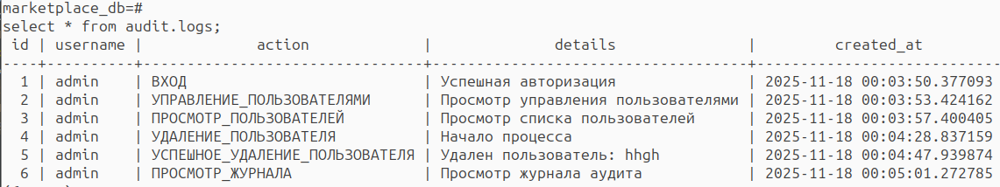
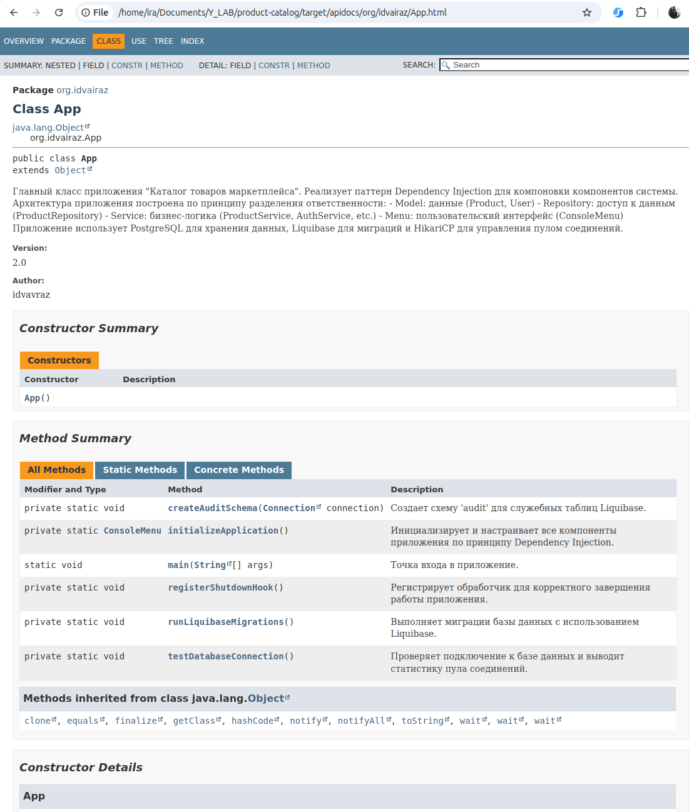

# Product Catalog Service. Servlets. AOP

**III Задание в рамках Java интенсива от Y_LAB** 

[ТЗ подробнее](./task.md)

## Технологический стек

- Java 17
- Maven 3.6+
- PostgreSQL 15 + Liquibase (миграции БД)
- Jakarta Servlet API (REST API)
- Embedded Tomcat (веб-сервер)
- Jackson (JSON сериализация)
- MapStruct (маппинг DTO)
- Hibernate Validator (валидация DTO)
- AspectJ (аспекты для аудита и логирования)
- HikariCP (пул соединений)
- Docker & Docker Compose (контейнеризация БД)

## Архитектурные изменения

### Переход на REST API + Servlets

- Консольное меню заменено на REST API
- Servlet-ы для каждого домена: Product, User, Auth
- JSON input/output для всех запросов
- HTTP статус коды: 200, 201, 400, 404, 500

## Функциональные возможности

### Система аутентификации и авторизации

```bash
# Регистрация пользователя
curl -X POST http://localhost:8080/api/auth/register \
  -H "Content-Type: application/json" \
  -d '{"username":"testuser","password":"password123"}'

# Вход в систему (с сохранением куки сессии)
curl -c cookies.txt -X POST http://localhost:8080/api/auth/login \
  -H "Content-Type: application/json" \
  -d '{"username":"testuser","password":"password123"}'

# Получить информацию о текущем пользователе
curl -b cookies.txt http://localhost:8080/api/auth

# Выход из системы
curl -b cookies.txt -X POST http://localhost:8080/api/auth/logout

```
### Управление товарами (Products)

```bash
# Получить все товары
curl http://localhost:8080/api/products

# Получить товар по ID
curl http://localhost:8080/api/products/1

# Получить товары по категории
curl http://localhost:8080/api/products/category/Electronics

# Получить товары по бренду
curl http://localhost:8080/api/products/brand/TestBrand

# Создать новый товар
curl -X POST http://localhost:8080/api/products \
  -H "Content-Type: application/json" \
  -d '{
    "name": "New Product",
    "description": "Product description",
    "price": 99.99,
    "category": "Electronics",
    "brand": "TestBrand",
    "stockQuantity": 10
  }'

# Обновить товар (частичное обновление)
curl -X PUT http://localhost:8080/api/products/1 \
  -H "Content-Type: application/json" \
  -d '{"name":"Updated Product","price":149.99}'

# Удалить товар
curl -X DELETE http://localhost:8080/api/products/1
```

### Управление пользователями (Users)

```bash
# Получить всех пользователей
curl http://localhost:8080/api/users

# Получить пользователя по ID
curl http://localhost:8080/api/users/1

# Создать пользователя с ролью
curl -X POST http://localhost:8080/api/users \
  -H "Content-Type: application/json" \
  -d '{
    "username": "manager1",
    "password": "pass123", 
    "role": "MANAGER"
  }'

# Изменить роль пользователя
curl -X PUT http://localhost:8080/api/users/2 \
  -H "Content-Type: application/json" \
  -d '{"role":"ADMIN"}'

# Удалить пользователя по ID
curl -X DELETE http://localhost:8080/api/users/2

# Удалить пользователя по имени
curl -X DELETE http://localhost:8080/api/users/name/testuser
```

### Валидация и обработка ошибок

```bash
# Пример ошибки валидации - пустое имя
curl -X POST http://localhost:8080/api/products \
  -H "Content-Type: application/json" \
  -d '{"name":"","price":99.99}'

# Пример ошибки валидации - отрицательная цена
curl -X POST http://localhost:8080/api/products \
  -H "Content-Type: application/json" \
  -d '{"name":"Test","price":-100}'

# Пример - товар не найден
curl http://localhost:8080/api/products/9999
```


## Поддержка всех HTTP методов (GET, POST, PUT, DELETE)

### Сервлеты принимают и отдают JSON
- Jackson для сериализации/десериализации
- Настроена поддержка Java 8 Date/Time API

### Эндпоинты

- /api/products/* - управление товарами
- /api/users/* - управление пользователями
- /api/auth/* - аутентификация

### Cтатус-коды HTTP

- 200 - Успешный запрос
- 201 - Создан новый ресурс
- 400 - Ошибка валидации
- 404 - Ресурс не найден
- 500 - Внутренняя ошибка сервера

### DTO с валидацией

### MapStruct для маппинга сущностей в DTO

### Валидация входящих DTO

- Автоматическая проверка перед обработкой запроса
- Cообщения об ошибках

### Аудит действий пользователя через аспекты

- AuditAspect - логирование бизнес-действий с аннотацией 
- HttpAuditAspect - логирование HTTP запросов

### Логирование выполнения методов с замером времени через аспекты

### Сохранение аудита в PostgreSQL
Все действия пользователей сохраняются в БД

## Быстрый старт

### Сборка и запуск

```bash
# Клонирование репозитория
git clone <repository-url>
cd product-catalog

# Сборка проекта
mvn clean compile

# Запуск приложения
mvn exec:java -Dexec.mainClass="org.idvairaz.App"
```
### Запуск через IDE

- Открыть проект в IntelliJ IDEA
- Найти класс org.idvairaz.App
- Запустите метод main()

### Запуск с Docker 

```bash
# Запуск PostgreSQL в контейнере
docker compose up -d

# Подключение к БД:
psql -h localhost -p 5432 -U marketplace_user -d marketplace_db

пароль marketplace_pass

# Показать все схемы в базе данных:
\dn

# Показать все таблицы в текущей схеме:
\dt

# Показать все таблицы во всех схемах:
\dt *.*

# Показать таблицы в конкретной схеме (marketplace):
\dt marketplace.*

# Показать информацию о таблице
\d table_name

# Показать все последовательности
\ds
```

### Мониторинг журнала аудита

Все действия пользователей логируются в таблице audit.logs.




```bash
# Просмотр записей аудита
SELECT * FROM audit.logs;

# Статистика действий по пользователям
SELECT username, action, COUNT(*) as count 
FROM audit.logs 
GROUP BY username, action 
ORDER BY count DESC;
```

## Тестирование 

### Стратегия тестирования

Проект покрыт комплексными тестами с использованием современных подходов:

#### Unit-тесты сервлетов
- **Mockito** для изоляции тестируемых компонентов
- **SoftAssertions** для комплексной валидации нескольких условий
- **Instancio** для автоматической генерации тестовых данных

## Особенности реализации

### Миграционные скрипты Liquibase
### Управление соединениями
- **Hikari Connection Pool** - эффективное управление соединениями
- **Обработка исключений** - корректное закрытие ресурсов

### Безопасность
- Изолированные учетные данные - отдельный пользователь БД для приложения
- Схемы безопасности - разделение прав доступа
- Параметризованные запросы - защита от SQL-инъекций

### Качество кода

- **Checkstyle** - Статический анализ кода
Проект использует Checkstyle для поддержания единого стиля кодирования:

- **Конфигурация**: checkstyle.xml в корне проекта

- **Проверка при сборке**: автоматический запуск в фазе validate

- **Строгий режим**: сборка прерывается при обнаружении нарушений

- **Единые стандарты**: соглашения по именованию, отступам, структуре кода

### JavaDoc - Полная документация кода

Весь публичный API задокументирован с помощью **JavaDoc**:

- Полное покрытие: все классы, методы, поля
- Подробные описания: назначение, параметры, возвращаемые значения
- Отчет Java генерируется по пути target/apidocs/index.html



### Полная документация проекта 

генерируется по пути target/site/index.html


### Генерация всех отчетов

```
mvn site
```

