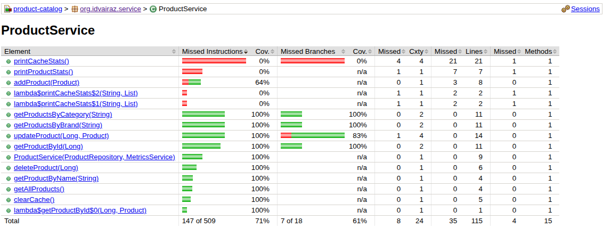

# Product Catalog Service - Каталог товаров маркетплейса

**I Задание в рамках Java интенсива от Y_LAB** 

[ТЗ подробнее](./task.md)

## Технологический стек

- Java 17
- Maven 3.6+
- Java Core Collections
- Файловая сериализация

## Функциональные возможности

### Система авторизации и ролей

**USER (Обычный пользователь)**
- Просмотр всех товаров
- Поиск товара по ID
- Поиск товара по имени
- Поиск товаров по категории
- Поиск товаров по бренду
- Просмотр статистики кэша
- Просмотр времени выполнения операций

**MANAGER (Менеджер)**
- Все возможности USER
- Добавление новых товаров
- Обновление существующих товаров
- Удаление товаров
- Просмотр журнала аудита

**ADMIN (Администратор)**
- Все возможности MANAGER
- Управление пользователями
- Просмотр всех зарегистрированных пользователей

### Управление товарами

- **Добавление товаров** - название, описание, цена, категория, бренд, количество
- **Просмотр товаров** - краткий и подробный формат отображения
- **Поиск и фильтрация** - по ID, названию, категории, бренду
- **Обновление товаров** - изменение всех параметров существующих товаров
- **Удаление товаров** - удаление по идентификатору

### Производительность и мониторинг

- **Кэширование данных** - трехуровневый кэш (по ID, категориям, брендам)
- **Статистика кэша** - эффективность попаданий, размеры кэшей
- **Метрики приложения** - статистика операций, экстремумы
- **Журнал аудита** -  логирование всех действий пользователей

### Сохранение данных

- **Автоматическое сохранение** - данные сохраняются после каждой операции
- **Восстановление при запуске** - автоматическая загрузка при старте приложения
- **Файловое хранение** - бинарные файлы `products.dat` и `users.dat`

## Быстрый старт

### Сборка и запуск

```bash
# Клонирование репозитория
git clone <repository-url>
cd product-catalog

# Сборка проекта
mvn clean compile

# Запуск приложения
mvn exec:java -Dexec.mainClass="org.idvairaz.App"
```
### Запуск через IDE

- Откройте проект в IntelliJ IDEA или другой Java IDE
- Найдите класс org.idvairaz.App
- Запустите метод main()

## Тестирование 

### Стратегия тестирования
- 100% покрытие бизнес-логики (print'ы не тестируются)- сервисы с наиболее высоким прирететомProductService и AuthService
- Паттерн "Given-When-Then" - четкая структура тестов
- Модульное тестирование - изоляция компонентов с помощью Mockito
- Fluent assertions - читаемые проверки с AssertJ

### Отчеты о покрытии
Отчет JaCoCo генерируется по пути target/site/jacoco/index.html и показывает детальную статистику покрытия кода тестами.





### Тестовые пользователи

**При первом запуске создаются пользователи по умолчанию:**

| Логин | Пароль | Роль | Возможности |
|-------|--------|------|-------------|
| admin | admin123 | ADMIN | Полный доступ |
| manager | manager123 | MANAGER | Управление товарами + аудит |
| user | user123 | USER | Просмотр и поиск |
 

## Особенности реализации

### Валидация данных

- Проверка уникальности названий товаров
- Валидация цен (положительные числа)
- Проверка количества (неотрицательные числа)
- Поддержка русского и международного формата чисел (999.99 или 999,99)

### Обработка ошибок

- Подробные сообщения об ошибках ввода
- Защита от некорректных данных
- Восстановление после ошибок
- Логирование исключений


### Архитектурные принципы

- Слоистая архитектура с четким разделением на Model, Repository, Service, Menu
- Интерфейсы для легкой замены реализаций
- Инъекция зависимостей через конструкторы
- Принцип единственной ответственности

### Качество кода

- **Checkstyle** - Статический анализ кода
Проект использует Checkstyle для поддержания единого стиля кодирования:

- **Конфигурация**: checkstyle.xml в корне проекта

- **Проверка при сборке**: автоматический запуск в фазе validate

- **Строгий режим**: сборка прерывается при обнаружении нарушений

- **Единые стандарты**: соглашения по именованию, отступам, структуре кода

### JavaDoc - Полная документация кода

Весь публичный API задокументирован с помощью **JavaDoc**:

- Полное покрытие: все классы, методы, поля
- Подробные описания: назначение, параметры, возвращаемые значения
- Отчет Java генерируется по пути target/site/apidocs/index.html


### Полная документация проекта 

генерируется по пути target/site/index.html


### Генерация всех отчетов

```
mvn site
```

